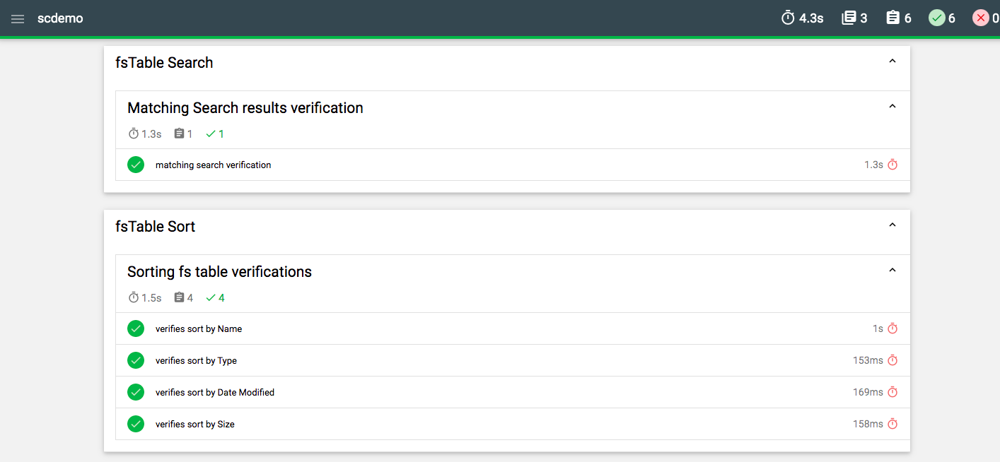

# Mochaweome reports

Mochawesome is a Mocha Reporter that generates standalone HTML/CSS reports to visualize your JavaScript Mocha tests simply and efficiently. Mochawesome runs on Node.js and is supported on all the leading test frameworks that support the Mocha style of writing tests.

https://www.npmjs.com/package/mochawesome-report-generator